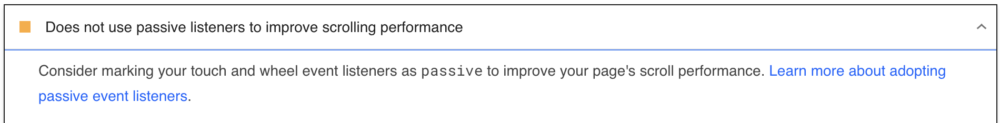
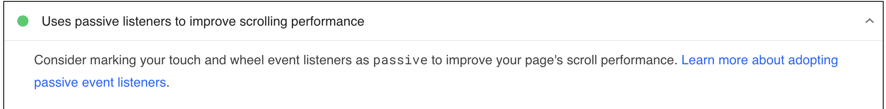

# Magento 2 jQuery Passive Listeners PageSpeed

The Collab_JqueryPassiveListenersPageSpeed is a simple Magento 2 module which improves PageSpeed Insights score 
by marking jQuery's touch and wheel event listeners as passive. 

## Basic usage
No special configuration is required. Module's mixin will handle all the necessary changes.

## PageSpeed
After installation Diagnostic information about passive listeners should be marked as passed audit. Having this passed also
means that overall PageSpeed score should be improved.

| Before installation | After installation |
|---------------------|--------------------|
|  |  |


## Installation details
```bash
composer req collab/module-jquery-passive-listeners-page-speed
bin/magento setup:upgrade
```
